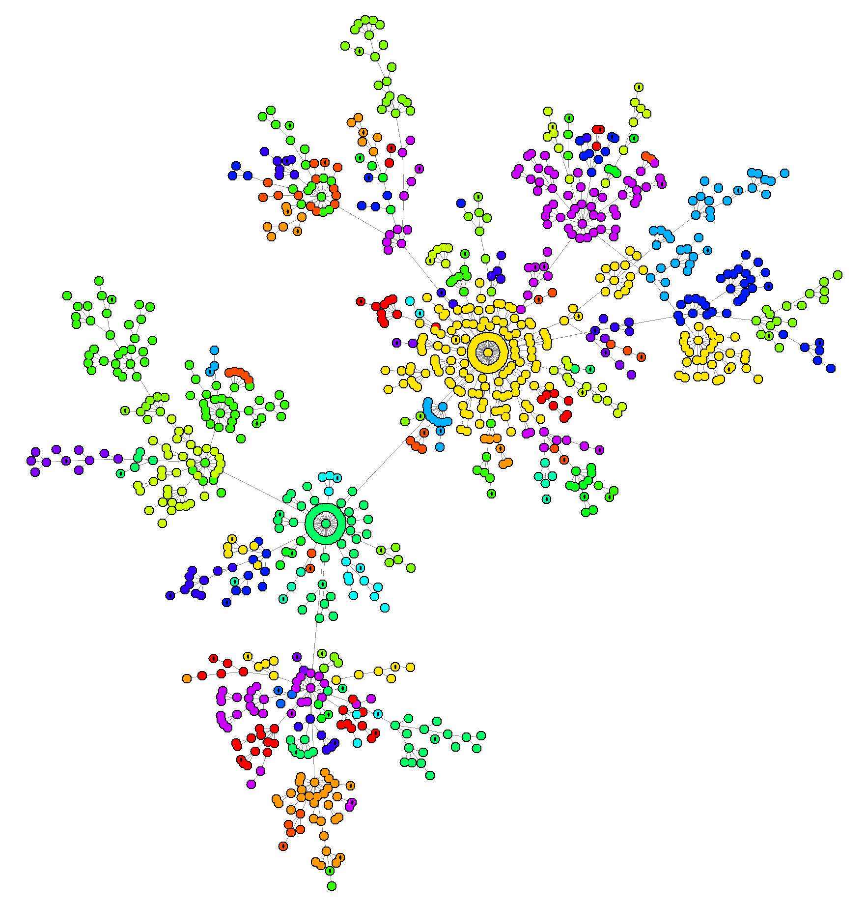

#### Note for impatients

Just want to see it running? Fire up a terminal, then:
* Linux/MacOS
```
curl https://raw.githubusercontent.com/DanySK/experiment-2022-self-stab-leader-election/master/quicklaunch.sh | sh 
```
* Windows/Powershell
```powershell
curl https://raw.githubusercontent.com/DanySK/experiment-2022-self-stab-leader-election/master/quicklaunch.ps1 | Select-Object -ExpandProperty Content | powershell.exe
```

Press <kbd>L</kbd> to visualize the links,
then press <kbd>P</kbd> to start the simulation.
Right click and drag to move around.
Use the mouse wheel to zoom in/out.

# Self-stabilizing Leader Election



(because a non-self-stabilizing one looks like this ^ )

This repository contains experiments on self-stabilizing leader election
developed with the
[Protelis](http://protelis.github.io/)
and
[ScaFi](https://scafi.github.io/)
programming languages
and executed using
the [Alchemist Simulator](https://github.com/AlchemistSimulator/Alchemist).

Every release in the repository is archived on Zenodo: [](https://zenodo.org/badge/latestdoi/492755314)

## Prerequisites

* A working version of Java, the supported version range is 8 to 17
  * If you do not have Java, we recommend to install a version from [Adoptium](https://adoptium.net/)
* A working version of Python 3.10.x or above, including `pip`
  * If you do not have Python or are stuck with an older version, you can obtain a fresh one from [this page](https://www.python.org/downloads/)
* A working Internet connection

## How to launch

As first step, use `git` to locally clone this repository:
``https://github.com/DanySK/experiment-2022-self-stab-leader-election.git``

If you do not have git, you can still [download the latest version of the code as a zip file](https://github.com/DanySK/experiment-2022-self-stab-leader-election/archive/refs/heads/master.zip).
Unpack it, and open a terminal inside the unpacked folder

To run the example you can rely on the pre-configured [Gradle](https://gradle.org) build script.
It will automatically download all the required libraries, set up the environment, and execute the simulator via command line for you.

Simulations can be included in the `src/main/yaml` folder, and executed via the `runAll` Gradle task.

For each YAML file in `src/main/yaml` a task `runFileName` will be created.

In order to launch, open a terminal and move to the project root folder, then on UNIX:
```bash
./gradlew runBarabasiGraphic
```
On Windows:
```
gradlew runBarabasiGraphic
```

Press <kb>P</kb> to start the simulation.
For further information about the GUI, see the [graphical interface shortcuts](https://alchemistsimulator.github.io/reference/default-ui/).

Note that the first launch will require some time, since Gradle will download all the required files.
They will get cached in the user's home folder (as per Gradle normal behavior).

### Bundled experiments

The following experiments are bundled:

#### `runBarabasiGraphic`
runs the leader election process in a Barabasi-Albert topology


#### `runRandomGraphic`

runs the leader election process in a random network with mobile devices

#### `runEdgeGraphic`

runs the leader election process in a random network with some static edge servers.

All the experiments can be executed in batch mode (for generating data in parallel)
by replacing `Graphic` with `Batch`.

## Re-generating all the data

The experiment is entirely reproducible.
Regenerating all the data may take a long time on a well-equipped 2022 personal computer.
The process is CPU-intensive and we do not recommend running it on devices where heat can be damaging to the battery.

In order to re-run all the experiments, launch:
```bash
./gradlew runBarabasiBatch runRandomBatch runEdgeBatch
```
data will be generated into the `data` folder

**Note**: re-running the whole batch makes sense if:
1. you need to prove that the results are exactly reproducible, or
2. you made changes and want to re-run the whole experiment.

Otherwise, it is recommended to leverage the data that we attached to the repository.

## Re-generating the charts from the paper

If you are just willing to re-run the data analysis and generate all the charts in the paper,
you can use the data we generated in the past:

```bash
pip install --upgrade pip --user
pip install -r requirements.txt --user
mkdir -p charts
python process.py
```

**Note**: there is no need to re-run all the simulations if the goal is to reproduce the charts of the paper.
We do track the result of our execution, which can be reused for the data analysis.
